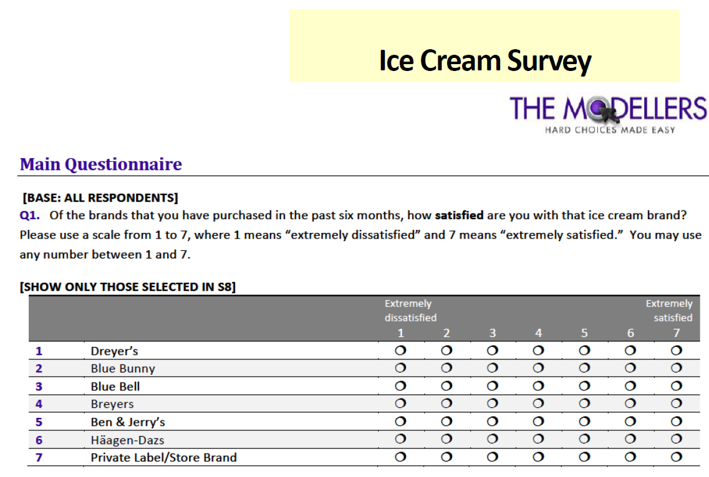

```{r setup, include=FALSE, echo=FALSE, eval=TRUE} 
knitr::opts_chunk$set(echo = TRUE, comment=NA, eval=TRUE, echo=TRUE, warning=FALSE, message=FALSE, error=FALSE, root.dir = "E:/Marketing Analytics-- K. Deal/Assignment_1") ##echo is for the codes, eval is for the outputs
```
# Statement of authorship

I have executed and prepared this assignment and document by myself without the help of any other person.
Signature:

```{r echo=FALSE, fig.width=5, fig.height=3}
knitr::include_graphics(path = "./signature.png") ##for the signature
```

# Ice Cream Survey analysis

This work is a preliminary data analysis task done on a survey data set done on ice cream brands. Its purpose is to clean and prepare the data set so that it can be used most easily by the analysts. This data set accompanies the “Seven Summits of Marketing Research” text by Greg Allenby and Jeff Brazell and is used with their permission.

```{r fs_Q_main,   fig.width = 9, fig.height = 9, dpi = 50}

```    

```{r fig.width = 9, fig.height = 9, dpi = 50}

```    

## Reading the Ice Cream data set

The first step is to load the data and required packages.

```{r Starting off}
library(dplyr)
library(psych)
library(DT)
library(tidyverse)
ic<- read.csv("./IceCream_raw.csv")
#ic<- read.csv("http://bus-sawtooth.mcmaster.ca/M733_ONLINE_F2020/IceCream_raw.csv")
```
and take a glance at what it offers.
```{r}
headTail(ic) %>% datatable( rownames = TRUE, filter="top", options = list(pageLength = 10, scrollX=T))
```

## Reducing the raw data to essential variables

In this analysis we are only focusing on the Dreyer's brand. Based on the questionnaires we only need to analyze certain columns. 
```{r}
d_names <- c(grep("^D.$", names(ic), value = TRUE), "D10")
q11 <- grep("^Q11_", names(ic), value = TRUE)
q11_1 <- grep("^Q11_1_", q11, value = TRUE) ##Only for the Dreyer's brand
s7 <- grep("^S7_", names(ic), value = TRUE)
s8 <- grep("^S8_", names(ic), value = TRUE)
col_names <- c("ID",s7, s8, "Q1_1","Q2_1","Q3_1", q11_1, d_names)
```
The data and its selected variables are depicted below. The S7 and S8 are chose from the screener questions to identify the participants who have heard about or have purchased our brand in the past 6 months. Also the behavioral questions needed for this analysis that are Q1,Q2,Q3 and Q11 are selected for the Dreyer's brand. Each question is coded with a number in its name that shows the corresponding ice cream brand. The number assigned to the Dreyer's brand is 1, therefore we choose Q1_1, Q2_1 ,etc. 

```{r}
ic_sub <- ic[col_names]
headTail(ic_sub,5,5) %>% datatable( rownames = TRUE, filter="top", options = list(pageLength = 12, scrollX=T))
```

## Filtering the participants

Starting to inspect the Dryer's brand. it is evident that many NA values are present in S8 questions. Which by looking at the S7 question (Having heard of this brand) it shows that those are the people who have not heard of this brand and therefore should be omitted from this analysis.
<br>
```{r echo=FALSE}
library(kableExtra)
table(ic_sub$S7_1, useNA='always')%>%
  kable("html", align = 'clc', caption = "Heard of Dreyer's Brand", col.names=c("S7_1", "Freq")) %>%
    kable_styling(bootstrap_options = "striped", full_width = F, position = "float_left")

table(ic_sub$S8_1, useNA='always') %>%
  kable("html", align = 'clc', caption = "Purchased Dreyer's brand in last 6 months", col.names=c("S8_1", "Freq")) %>%
    kable_styling(bootstrap_options = "striped", full_width = F, position = "right")
```
The following tables shows the participants (rows) that have the S8_1 variable missing. It also shows that these are the people who have not heard of our brand **(S7_1 == 0)**.
```{r}
ic[is.na(ic["S8_1"]),c("ID", "S7_1", "S8_1","Q1_1","Q2_1","Q3_1" )] %>% datatable( rownames = TRUE, filter="top", options = list(pageLength = 10, scrollX=T))
```

### filtering rows

As the variable S7_1 has no missing values and it can effectively identify the people who have not heard of, therefore not purchased the Dreyer's brand. These are the people who we need to exclude from the analysis and save the remaining subset to **ic_sub_1**
```{r}
ic_sub_1 <- ic_sub %>% filter(!(S7_1 == 0))
```
Checking the S7_1 and S8_1 in the new filtered data
```{r}
sjmisc::frq(ic_sub_1$S7_1, out = 'v', title = "Heard of Dreyer's Brand (S7_1)")
sjmisc::frq(ic_sub_1$S8_1, out = 'v', title = "Purchased Dreyer's brand in last 6 months (S8_1)")
```
<br> 
You can see that there is no missing values anymore in these two variables.

## Missing values analyses

We filtered our subset of the data for the Dreyer's brand analysis. Now let's look at missing values in this subset.
```{r}
options(max.print = 100000)
library(inspectdf)
ic_sub_1 %>% inspect_na()  %>% datatable( rownames = TRUE, filter="top", options = list(pageLength = 10, scrollX=T))
```
and the following figures to see the pattern of the missing data.
```{r fig.width= 7, fig.height= 7}
library(VIM)
ic_sub_1[, c(2:47)] %>% aggr(col=c('navyblue','red'), numbers=TRUE, sortVars=TRUE, cex.axis=.7, gap=3, ylab=c("Histogram of missing data","Pattern"))
```
First the S7 and S8 for other brands are removed. Now we look at the remaining variables and their missing counts.
```{r}
ic_sub_2 <- ic_sub_1[c("ID", "S7_1", "S8_1", "Q1_1", "Q2_1", "Q3_1", q11_1, d_names)]
library(inspectdf)
ic_sub_2 %>% inspect_na %>% datatable( rownames = TRUE, filter="top", options = list(pageLength = 10, scrollX=T))
```
The demographics variables have no missing values. The subset of S7_1 and S8_1 has no missing point either. We only have 28% missing in Q11 questions and 66% for Q1-Q3. The latter makes total sense because those are the people who have not purchased the product in last 6 months, therefore, have not been asked to answer Q1-Q3 questions. These questions are missing 234 rows which is the same number of people who have not purchased the brand in S8_1. The code below shows this.

```{r}
ic_sub_2[c("ID", "S7_1", "S8_1", "Q1_1", "Q2_1", "Q3_1")] %>% filter(S8_1 ==0) %>% nrow()
```
Therefore, the number of missing points in Q1-Q3 is the same as number of people who have not purchased the brand in 6 months and their missing values should not be imputed as it does not make sense to do so!

### Imputing the valid variables using mice

The only valid variables that require imputation are the seventeen Q11s. So only this subset of our "ic_sub_2" is passed to 'mice' function. The following code uses 'mice' to generate m=5 new imputed data sets using the Random Forest Imputation method.

```{r cache=TRUE}
library(mice) 
set.seed(456)
ic_to_impute <- ic_sub_2[q11_1]
tempData <- mice(ic_to_impute, m=5, maxit=50, meth='rf', seed=500, print=FALSE) # This uses 'mice' to generate m=5 new imputed datasets using the 'rf' method and '500' as a seed to get the process initiated.
```

Taking a look at the imputed subset, it can be seen that there is no missing value anymore.
```{r}
compData <- mice::complete(tempData, 1)
headTail(compData, 20)  %>% datatable( rownames = TRUE, filter="top", options = list(pageLength = 10, scrollX=T))
# No missing point!
compData %>%  inspect_na() %>%  datatable( rownames = TRUE, filter="top", options = list(pageLength = 10, scrollX=T))
```

### Using the 'sjmisc' package to merge the 5 datasets into 1  

The "merge_imputations()" function from the 'sjmisc' package merges the 5 imputed data sets into one with the original number of rows, i.e., not in long format and depicts some comparison plots between the original variables and their imputed version.

```{r fig.width=9, fig.height=9}
library(sjmisc)  
mice_mrg <- merge_imputations(
ic_to_impute,
tempData,
summary = c("hist" ),
filter = NULL
)
mice_mrg
```
Printing the merged of all 5 imputed data set
```{r}
head( mice_mrg$data, 20 ) %>% datatable(rownames = TRUE, filter="top", options = list(pageLength = 10, scrollX=T)) 
```

## Comparing the imputed and original data sets statistically

The t-test is done to compare the means and variance of the imputed Q11s and the original subset.
```{r echo=FALSE}
library(kableExtra)
library(matrixTests)

d1 <- col_t_welch( ic_to_impute, mice_mrg$data )[c(1:2, 4:5, 12)]
d2 <- col_f_var(   ic_to_impute, mice_mrg$data )[c(4:5, 10)]
d1 %>%
  kable("html", align = 'clc', caption = '1st mice imp. using rf: Comparing means', digits=2, col.names=c("fs n", "fs micerf n", "fs mean", "micerf mean", "p-value")) %>%
    kable_styling(bootstrap_options = "striped", full_width = F, position = "float_left")

d2 %>%
  kable("html", align = 'clc', caption = 'Comparing variances', digits=2, col.names=c( "fs var", "micerf var", "p-value")) %>%
    kable_styling(bootstrap_options = "striped", full_width = F, position = "right")
```
By looking at the p-value and comparing them to our confidence interval of 95%. Imputation does well in the means but rather poorly in the variance. In the variance table, many of the seventeen questions have a p-value under the 0.05 limit. Evidently the merge-of-five imputations decreases the variance too much and has statistically significant difference with the original subset in terms of variance.
<br>
This was surprising to me therefore I looked at each of the 5 imputed data sets to see how they perform in terms of variance.

```{r echo=FALSE}
compData <- mice::complete(tempData, 4)
d1 <- col_t_welch( ic_to_impute, compData )[c(1:2, 4:5, 12)]
d2 <- col_f_var(   ic_to_impute, compData )[c(4:5, 10)]

d1 %>%
  kable("html", align = 'clc', caption = '3rd mice imp. using rf: Comparing means', digits=2, col.names=c("fs n", "fs micerf n", "fs mean", "micerf mean", "p-value")) %>%
    kable_styling(bootstrap_options = "striped", full_width = F, position = "float_left")

d2 %>%
  kable("html", align = 'clc', caption = 'Comparing variances', digits=2, col.names=c( "fs var", "micerf var", "p-value")) %>%
    kable_styling(bootstrap_options = "striped", full_width = F, position = "right")
# 1--> 9 , 3
# 2--> 1,3,9,~13
# 3--> 9
# 4--> 3,6,9
# 5--> 2,3,6,9
```
As seen in the above tables, the single imputed data sets perfrom much better in terms of not changing the variance significantly. Moreover, the 4th imputed data set performs better than all five and the merged one.
<br>
The below histograms for one of the imputed variables (Q11_1_1) shows that the merged imputed data set is inclined to impute the missing values to be equal to the mod and thus, decrease the variance significantly. Whereas, the single imputed data set distributes the missing values in all 7 levels based on the original mean and variance.

```{r}
pacman::p_load(epiDisplay)
i = q11_1[7]
tab1(ic_to_impute[i], main = "Q11_1_1 distribution in the original data set" )
tab1(mice_mrg$data[i], main = "Q11_1_1 distribution in the merged-of-5 imputed data set" )
tab1(compData[i], main = "Q11_1_1 distribution in the 4th imputed data set")

```

### Combining the imputed data

The best imputed data set is the fourth one in all 5 imputed data sets. Therefore, it is chosen to be combined with the original data set.

```{r }
ic_sub_2[q11_1] <- compData
ic_sub_2 %>%  datatable( rownames = TRUE, filter="top", caption = "The imputed and complete data set", options = list(pageLength = 10, scrollX=T))
```

## Renaming the variables

The variables in the final subset of the ice cream data are renamed to make further analysis easier.

```{r}
demo_names <- c("Gender", "Age", "Marital", "Children_less_18", "Household_size", "Education", "Employment", "Ethnicity",
                "Household_income", "Residence_state")
names(ic_sub_2) <- c(c("ID", "Heard_of_brand", "Purchased_last6mo", "Satisfaction", "Buying_likelihood", "Recommend_likelihood",
                     "is_relaxing", "is_wholesome", "is_fun",
                     "is_exciting","is_premium_quality", "is_memorable", "is_treat", "is_good_for_regular",
                     "is_interesting", "taste_better_other_brands", "has_many_flavors", "is_enjoyable", "has_best_value/price",
                     "is_organic", "is_low_cal", "is_great_for_family", "is_great_for_guests") , demo_names)

ic_sub_2 %>%  datatable( rownames = TRUE, filter="top", options = list(pageLength = 10, scrollX=T))
```

## Recoding the demographic variables

Now it's time to recode the values of different variables to a more meaningful format. Let's first look at the demographic variables and see their current values.
```{r}
library(wrapr)
tt<- function(x) { table( x,  useNA = "ifany" ) }
24:33 %.>% ( function(x) { sapply( ic_sub_2[, (x)], tt ) } )  (.) 
```

Now using different tools and the provided questionnaires, the following demographic variables are recoded and depicted in tables below.

```{r}
ic_sub_2$Gender <- ifelse( ic_sub_2$Gender == 1, "Male", "Female")
frq(ic_sub_2$Gender, out="v", show.na=TRUE, title= "Gender of the participants")
```

```{r}
ic_sub_2$Age <- recode_factor(ic_sub_2$Age,`1` = "Under 18",
                                          `2` = "18-24",
                                          `3` = "25-34",
                                          `4` = "35-44",
                                          `5` = "45-54",
                                          `6` = "55-64",
                                          `7` = "65 or older")
frq(ic_sub_2$Age, out="v", show.na=TRUE, title= "Age of the participants")
```

```{r}
ic_sub_2$Marital <- recode_factor(ic_sub_2$Marital,`1` = "Single, not living with domestic partner",
                                          `2` = "Single, living with domestic partner",
                                          `3` = "Married",
                                          `4` = "Divorced",
                                          `5` = "Separated",
                                          `6` = "Widowed",
                                          `7` = "Prefer not to say")
frq(ic_sub_2$Marital, out="v",sort.frq = c("desc"), show.na=TRUE, title= "Marital status of the participants")
```

```{r}
ic_sub_2$Children_less_18 <- ifelse(ic_sub_2$Children_less_18 == 1, "Yes", "No")
frq(ic_sub_2$Children_less_18, out="v", show.na=TRUE, title= "Does Participants have children under the age of 18 living with them")
```

No need to recode the household size as it is a numerical variable

```{r}
frq(ic_sub_2$Household_size, out="v", show.na=TRUE, title= "Number of people living in participants household")
```

```{r}
ic_sub_2$Education <- recode_factor(ic_sub_2$Education,`1` = "High school or less",
                                          `2` = "Trade/Technical school",
                                          `3` = "Some college or Associate's Degree",
                                          `4` = "Graduated College/Bachelor's Degree",
                                          `5` = "Attended Graduate School",
                                          `6` = "Advanced Degree (Master's, PhD.D.)")
frq(ic_sub_2$Education, out="v", show.na=TRUE, title= "Education of the participants")
```

```{r}
ic_sub_2$Ethnicity <- recode_factor(ic_sub_2$Ethnicity,`1` = "High school or less",
                                          `2` = "Trade/Technical school",
                                          `3` = "Some college or Associate's Degree",
                                          `4` = "Graduated College/Bachelor's Degree",
                                          `5` = "Attended Graduate School",
                                          `6` = "Advanced Degree (Master's, PhD.D.)")
frq(ic_sub_2$Ethnicity, out="v", show.na=TRUE, title= "Education of the participants")
```

```{r}
ic_sub_2$Employment <- recode_factor(ic_sub_2$Employment,`1` = "Employed full-time (30+ hrs)",
                                          `2` = "Employed part time",
                                          `3` = "Not Currently Employed",
                                          `4` = "Student",
                                          `5` = "Retired",
                                          `6` = "Homemaker")
frq(ic_sub_2$Employment, out="v", show.na=TRUE, title= "Education of the participants")
```

```{r}
ic_sub_2$Household_income <- recode_factor(ic_sub_2$Household_income,`1` = "under $50,000",
                                          `2` = "$50,000 just under $75,000",
                                          `3` = "$75,000 just under $100,000",
                                          `4` = "$100,000 just under $125,000",
                                          `5` = "$125,000 just under $150,000",
                                          `6` = "$150,000 just under $175,000",
                                          `7` = "$175,000 just under $200,000",
                                          `8` = "$200,000 or more",
                                          `9` = "Prefer not to say")
frq(ic_sub_2$Household_income, out="v", show.na=TRUE, title= "Household income of the participants")
```

The states were assigned a number, the actual name is not evident. There are a total of 50 states.

```{r}
frq(ic_sub_2$Residence_state, out="v", show.na=TRUE, title= "Residence state of the participants")
```

## Recoding the Perception and Attitude variables

Let's look at the current values of these variables. Which are Q1-Q3 and Q11_1_1 to Q11_1_17
```{r}
frq(ic_sub_2$Satisfaction, out="v", show.na=TRUE, title= "Different values in the Behavioral questions") 
```

The values span from 1 to 7 therefore we use a 7 Point Likert Scale to recode them. "1" being Extremely negative and "7" the extremely positive.

As these variables would be used for further analyses, to save their natural numerical format, the recoded categorical columns would be appended to end of data set.

```{r }
ic_sub_2$Satisfaction_cat <- dplyr::recode_factor(ic_sub_2$Satisfaction,
                                                  `1` = "Extremely Dissatisfied",
                                                  `2` = "Dissatisfied",
                                                  `3` = "Somewhat Dissatisfied",
                                                  `4` = "Neither Dissatisfied nor Satisfied",
                                                  `5` = "Somewhat Satisfied",
                                                  `6` = "Satisfied",
                                                  `7` = "Extremely Satisfied"
                       )
y <- c("Extremely Satisfied","Satisfied", "Somewhat Satisfied", "Neither Dissatisfied nor Satisfied",
  "Somewhat Dissatisfied", "Dissatisfied", "Extremely Dissatisfied")

ic_sub_2$Satisfaction_cat <- factor(ic_sub_2$Satisfaction_cat, levels = y )
frq(ic_sub_2$Satisfaction_cat, out="v", show.na=TRUE, title= "How satisfied with Ice Cream Brand")
```

Now we look at Q2 or Buying_likelihood variable in the data set.

```{r}
ic_sub_2$Buying_likelihood_cat <- dplyr::recode_factor(ic_sub_2$Buying_likelihood,
                                                  `1` = "Not at all Likely to purchase again",
                                                  `2` = "Not Likely to purchase again",
                                                  `3` = "Not Somewhat  Likely to purchase again",
                                                  `4` = "Neither Likely nor Unlikely to purchase again",
                                                  `5` = "Somewhat Likely to purchase again",
                                                  `6` = "Likely to purchase again",
                                                  `7` = "Extremely Likely to purchase again"
                       )

y <- c("Extremely Likely to purchase again", "Likely to purchase again",  "Somewhat Likely to purchase again",
  "Neither Likely nor Unlikely to purchase again",  "Somewhat Not Likely to purchase again",
  "Not Likely to purchase again",  "Not at all Likely to purchase again")

ic_sub_2$Buying_likelihood_cat <- factor(ic_sub_2$Buying_likelihood_cat, levels = y )
frq(ic_sub_2$Buying_likelihood_cat, out="v", show.na=TRUE, title= "How Likely to purchase brand again")
```

Now we look at Q3 or Recommendation likelihood variable in the data set.

```{r}
ic_sub_2$Recommend_likehood_cat <- dplyr::recode_factor(ic_sub_2$Recommend_likelihood,
                                                  `1` = "Not at all Likely to recommend",
                                                  `2` = "Not Likely to recommend",
                                                  `3` = "Not Somewhat  Likely to recommend",
                                                  `4` = "Neither Likely nor Unlikely to recommend",
                                                  `5` = "Somewhat Likely to recommend",
                                                  `6` = "Likely to recommend",
                                                  `7` = "Extremely Likely to recommend"
                       )

y <- c("Extremely Likely to recommend", "Likely to recommend",  "Somewhat Likely to recommend",
  "Neither Likely nor Unlikely to recommend",  "Somewhat Not Likely to recommend",
  "Not Likely to recommend",  "Not at all Likely to recommend")

ic_sub_2$Recommend_likehood_cat <- factor(ic_sub_2$Recommend_likehood_cat, levels = y )
frq(ic_sub_2$Recommend_likehood_cat, out="v", show.na=TRUE, title= "How Likely to recommend brand again")
```

### Recoding the brand perception and opinion variables

All 17 variables in this area (Q_1_1 to Q_1_17) could be coded with the same format. Again for not losing their numerical for further analyses, they are recoded into new variables and added to the data set. First we make those new categorical variables and then recode them. Tables of 17 "recoded" perception questions of Dreyer's brand appear next. 

```{r }
library(forcats)

ftt <- function(x) { ordered( x, levels = c("1", "2", "3", "4", "5", "6", "7")) }
ic_sub_2[, 37:53] <- 7:24 %.>% ( function(x) { lapply( ic_sub_2[, (x)], ftt ) } )  (.)

rr <- function(x) { dplyr::recode_factor( x,
                                          `1` = "Does not describe at all",
                                          `2` = "Does not describe",
                                          `3` = "Not Somewhat does describe",
                                          `4` = "Neither does nor does not describe",
                                          `5` = "Somewhat does describe well",
                                          `6` = "Does describe well",
                                          `7` = "Describes extremely well"
) }
ic_sub_2[, 37:53] <- 37:53 %.>% ( function(x) { lapply( ic_sub_2[, (x)], rr ) } )  (.)


frq( fct_rev(ic_sub_2[,37]), out="v", show.na=TRUE, title= "is relaxing")
frq( fct_rev(ic_sub_2[,38]), out="v", show.na=TRUE, title= "is wholesome" )
frq( fct_rev(ic_sub_2[,39]), out="v", show.na=TRUE, title= "is fun"           )
frq( fct_rev(ic_sub_2[,40]), out="v", show.na=TRUE, title= "is exciting"       )
frq( fct_rev(ic_sub_2[,41]), out="v", show.na=TRUE, title= "has premium quality")
frq( fct_rev(ic_sub_2[,42]), out="v", show.na=TRUE, title= "is memorable"            )
frq( fct_rev(ic_sub_2[,43]), out="v", show.na=TRUE, title= "Bought as special treat but not regularly")
frq( fct_rev(ic_sub_2[,44]), out="v", show.na=TRUE, title= "is good for regular consumption")
frq( fct_rev(ic_sub_2[,45]), out="v", show.na=TRUE, title= "is interesting")
frq( fct_rev(ic_sub_2[,46]), out="v", show.na=TRUE, title= "Tastes better than other brands" )
frq( fct_rev(ic_sub_2[,47]), out="v", show.na=TRUE, title= "Has many flavors")
frq( fct_rev(ic_sub_2[,48]), out="v", show.na=TRUE, title= "Is enjoyable"   )
frq( fct_rev(ic_sub_2[,49]), out="v", show.na=TRUE, title= "Has best value for price"   )
frq( fct_rev(ic_sub_2[,50]), out="v", show.na=TRUE, title= "is natural/organic")
frq( fct_rev(ic_sub_2[,51]), out="v", show.na=TRUE, title= "is low calorie")
frq( fct_rev(ic_sub_2[,52]), out="v", show.na=TRUE, title= "Great for whole family")
frq( fct_rev(ic_sub_2[,53]), out="v", show.na=TRUE, title= "Great for guests")
```

Changing the names of new categorical variables. Adding a suffix to imply their categorical format.

```{r eval=FALSE}
q <- c("is_relaxing", "is_wholesome", "is_fun",
                     "is_exciting","is_premium_quality", "is_memorable", "is_treat", "is_good_for_regular",
                     "is_interesting", "taste_better_other_brands", "has_many_flavors", "is_enjoyable", "has_best_value/price",
                     "is_organic", "is_low_cal", "is_great_for_family", "is_great_for_guests")

colnames(ic_sub_2)[37:53] <- gsub("$", "_cat", q)
```

Recoding the Heard of brand and Purchased brands variables and checking the data.
```{r}
ic_sub_2$Heard_of_brand <- ifelse(ic_sub_2$Heard_of_brand ==1, 'yes', 'no')
ic_sub_2$Purchased_last6mo <- ifelse(ic_sub_2$Purchased_last6mo ==1, 'yes', 'no')
```

## Saving the final data set

This recoded, imputed and filtered dataset is saved in your working directory by using the code below.  
```{r eval=FALSE}
write.csv(ic_sub_2, "./final_data.csv", row.names = FALSE)
```

# Conclusion

The final data set is consisted of 354 observations and 53 variables. It includes the behavioural questions (Q1-Q3 and Q11) for the Dreyer's brand and the demographic data of participants in both numerical and categorical format. The participants are people who have heard of Dreyer's brand and have both purchased and not purchased the brand in the past 6 months. The variable names has been recoded to represent their natural meaning and ease further analyses. Further info about the cleaned version of data could be find in previous sections. 

```{r}
ic_sub_2 %>%  datatable( rownames = TRUE, filter="top", options = list(pageLength = 5, scrollX=T))
```

